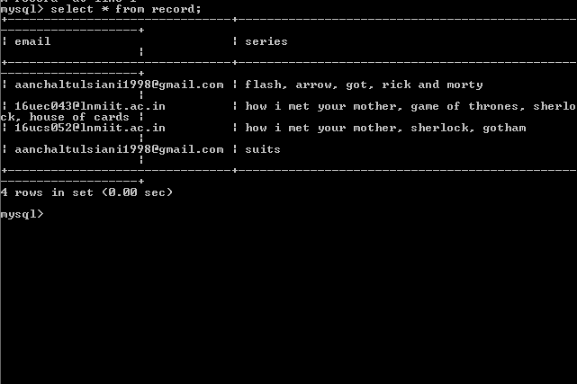

# IMDb-scrapper

## Problem Statement
The script requires email address and list of favourite TV series for multiple
users as input. The prompt needs to be as follows:
Email address:
TV Series:
Store the input data in MySQLdb table(s).

## Result Required
A single email needs to be send to the input email address with all the
appropriate response for every TV series. The content of the mail could
depend on the following use cases:
1. Exact date is mentioned for next episode.
2. Only year is mentioned for next season.
3. All the seasons are finished and no further details are available.

#### Another use case has been introduced i.e. "There is currently no information about upcoming episodes/seasons." in cases where no information has been given about the upcoming series.

## Note
Change the mysql "root" and "password" to th root name and password of your connector.
ALso replace the send_mail and password with your email id and password. 

## Approach
The code has been written in Python 3.
For scrapping the data from IMDb website, ####Beautiful Soup, a Python library for pulling data out of HTML and XML files, has been used.
####IMDbPY, a Python package to retrieve and manage the data of the IMDb movie database about movies, people, characters and companies, has also been used to fetch the url of the series.

### Prerequisites
Python3 and pip must be preinstalled
MySQL must be preinstalled

The libraries used in the code have to be installed explicitly using pip install ___ in case of Windows and sudo-apt install ___ in case of Ubuntu. 
the libraries to be installed for this code are:
pip3 install Beautifulsoup4
pip3 install PyMySQL
pip3 install imdbpy  or  pip install git+https://github.com/alberanid/imdbpy
pip3 install urllib3
pip3 install request

### Platform required
Anaconda, free and open source distribution of the Python and R programming languages, can be used to run the python executable file.
The file can also be executed directly from python shell.

### MySQL table for storing the records.

### A demo of the mail sent with status of favourite series

